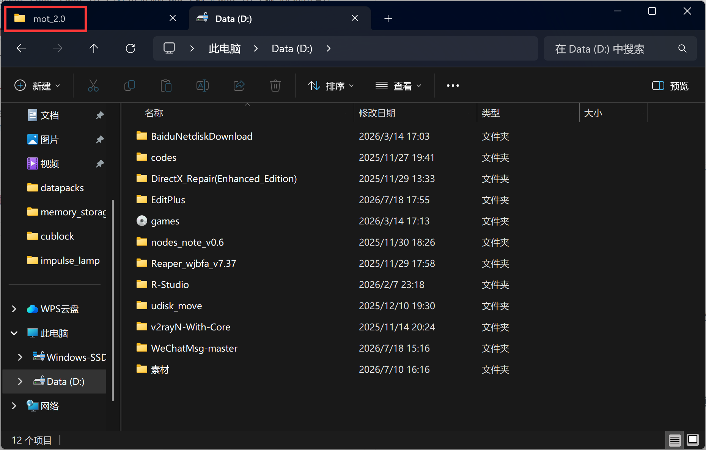
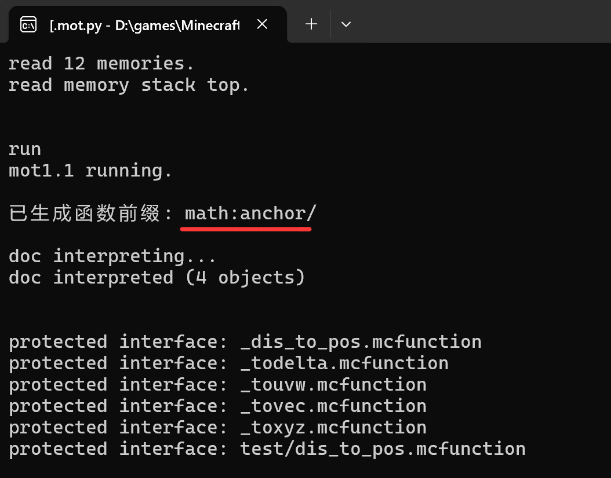
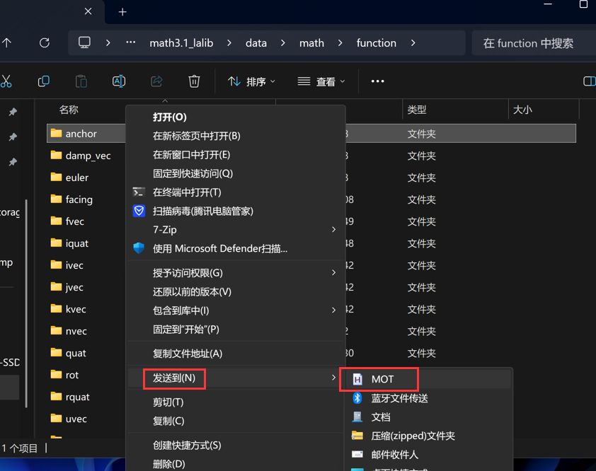

# mot_2.0
Mcfunction Object Template 2.0

## 安装使用方法

确保您的电脑上已经安装python和autohotkey，如果没有可以运行编程语言安装包文件夹中的安装程序

双击打开mot2.0.ahk运行

## 使用方法

对于mot来说，一个mcfunction模块（以下简称模块）是指：数据包目录/data/命名空间下的function文件夹，或者它的任意子文件夹。

在文件资源管理器中打开您的模块目录，确保窗口焦点是这个目录。

**win11用户请注意：mot不支持多标签页，如果文件资源管理器打开了多个标签页，mot只能抓到最左边的标签页。（如图所示）**

打开模块目录后，在当前目录下使用快捷键：

* ctrl+m：打开mot记忆栈（黑色终端窗口）
* ctrl+o：创建对象格式文档

第一次使用mot，您可以先在记忆栈中输入命令`run`

检查如图所示的函数前缀，命名空间和路径是否符合您的模块。

另外，如果您的模块中已有mcfunction文件，mot会自动保护，如上图中protected interface所示（仅在当前这一次运行时临时保护，不会产生多余文件）

连续输入两次`stop`命令结束运行。

如果记忆栈显示路径错误，或者显示的函数前缀有误，请查看[意外情况使用方法](#意外情况使用方法)

## 意外情况使用方法

请运行mot目录下的install_sendto.ahk，将mot安装到 **“发送到”** 菜单。

请注意，如果您的系统上安装了右键菜单管理软件，将 **“发送到”** 菜单隐藏，则需要恢复使用。

与正常使用方法中打开模块目录不同，您需要在目录外面对模块文件夹右键。

在菜单中找到并点击MOT选项。

- Open memory stack 对应正常使用方法中的快捷键ctrl+m
- Create .doc.mcfo 对应正常使用方法中的快捷键ctrl+o
  
其它选项并不常用，可以忽略。